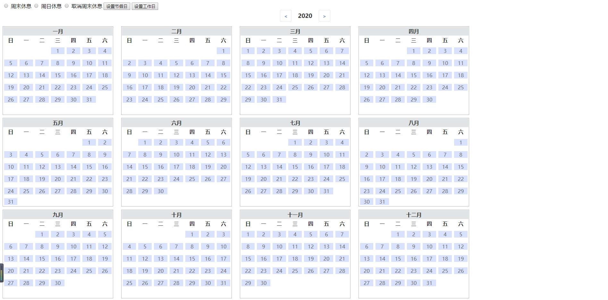

# date_picker 插件使用说明

## 初始化插件

```
    $1(selector).fullYearPicker({
        disable:false,//只读
        year:"2019",//指定年份
        initDate:[],//初始化选中日期
        yearScale: { min: 1949, max: 2100 },//初始化日历范围
        format:"YYYY-MM-DD",//日期格式化  YYYY-MM-DD  YYYY-M-D
        cellClick: function (dateStr, isDisabled) {
            //当前选中日期回调函数
        },
        choose:function (dateArr) {
            //实时获取所有选中的日期的回调函数
            console.log(dateArr)
        }
    })
    //ps: 是$1 不是$ !!!
```
## 修改周末状态
```
// color 是改变的颜色值
setWeekendWork(color)
```
## 修改周日状态
```
setSundayWork(color)
```
## 取消周末上班状态
```
cancelWeekendWork()
```
## 根据日期自定义设定状态（颜色）dateArr日期数组，colorArr颜色数组
```
// dateArr:['2019-01-01','2019-01-02']; colorArr:['red','blue'];
setColor4Date(dateArr,colorArr);
```
## 根据日期类型设定状态（颜色）
```
//dateTypeArr [{ bgColor:red,type:1,date:['2019-1-1','2019-1-2']}]
setColor4DateType(dateTypeArr)
```